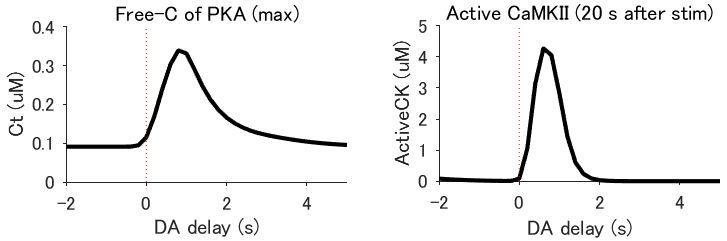

# Signaling models for dopamine-dependent temporal contiguity in striatal synaptic plasticity


[](https://www.gnu.org/licenses/gpl-3.0)

## Abstract
Animals remember temporal links between their actions and subsequent rewards. We previously discovered a synaptic mechanism underlying such reward learning in D1 receptor (D1R)-expressing spiny projection neurons (D1 SPN) of the striatum. Dopamine (DA) bursts promote dendritic spine enlargement in a time window of only a few seconds after paired pre- and post-synaptic spiking (pre–post pairing), which is termed as reinforcement plasticity (RP). The previous study has also identified underlying signaling pathways; however, it still remains unclear how the signaling dynamics leads to RP. In the present study, we first developed a computational model of signaling dynamics of D1 SPNs. The D1 SPN model successfully reproduced experimentally observed PKA activity, including its critical time window. In this model, adenylate cyclase type 1 (AC1) in the spines/thin dendrites played a pivotal role as a coincidence detector of pre–post pairing and DA burst, whereas well-known AC5 seemed to work in the somas. We also found that the smallness of the spines/thin dendrites is crucial for the short time window of the PKA activity. We then developed a D2 SPN model, and this model again predicted the critical time window for RP that depended on the timing of pre–post pairing and phasic DA dip. In the D2 SPN model, AC1 again worked for the coincidence detector. We further simulated the signaling pathway toward CaMKII and clarified the role of the downstream molecules of AC1 as the integrators of transient input signals into persistent spine enlargement. Finally, we discuss how such timing windows guide animals' reward learning.

## System requirements

Matlab 2017b or newer plus the toolbox SimBiology. We confirmed the safe executions of sample programs on Matlab 2017b and 2018a.

## Installation

1. Download the source codes from the github site:

	- git clone https://github.com/urakubo/UNI-EM.git

2. Execute main_sample.m, then the following figure will appear.

<BR>
<p align="center">
  
</p>
<BR>

3. Execute main_fig_timing.m and main_fig_prof.m, and confirm the figures of the time window for reinforcement plasticity and its molecular activities.

<BR>
<p align="center">
  
</p>
<BR>

## Nano extension on SimBiology

We wrote utility functions for the effective implementation of RP signaling model on SimBiology/MatLab. The program [main_example.m](./main_sample.m) was written to explain how to use those functions. First, the extensions become callable by adding the path to the "./func" directory:
```
addpath('./funcs');
``` 
Then, define the tables of init_species and init_params, and call DefineModel to build a SimBiology model object:
```
_species   = {
		'A'		, 2	;
		'B'		, 1	;
		'C'		, 0
		};
	init_species = cell2table( _species, 'VariableNames', {'Name','Conc'});
	init_species.Properties.RowNames = _species(:,1);

_params   = {
		'kf'			, 0.5;
		'kb'			, 0.5;
		};
	init_params = cell2table( _params, 'VariableNames', {'Name','Param'});
	init_params.Properties.RowNames = _params(:,1);

[model, species, params] = DefineModel(init_species, init_params, Tstop);
```
Then, users can add the reactions by calling the functions Reac11, Reac12, Reac21, ReacChannel, ReacEnz, etc., as follows:
```
Reac21('A','B','C', 'kf','kb', model)	; % A + B <-kb kf-> C
```
Finally, run the SimBiology simulation function and plot the simulation results:
```
sd = sbiosimulate(model);
```
The programs for D1/D2 RP ("main_fig_prof.m" and "main_fig_timing.m") call "./models/load_model.m " for the definitions of the D1/D2 signaling model. 

## License

This project is licensed under the MIT license - see the [LICENSE](LICENSE) file for details.

## Reference
Signaling models for dopamine-dependent temporal contiguity in striatal synaptic plasticity

Hidetoshi Urakubo, Sho Yagishita, Haruo Kasai, and Shin Ishii

PLoS Comp. Biol., In revision.

2019/11/20

Correspondence: hurakubo@gmail.com
